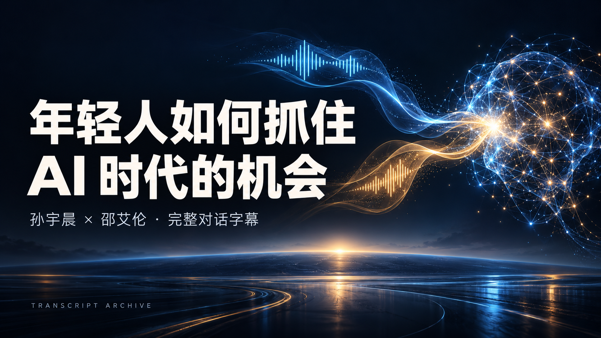

<p align="center">
  <a href="TRANSCRIPT.md"></a>
</p>

<h1 align="center">年轻人如何抓住 AI 时代的机会？</h1>

<p align="center">孙宇晨 × 邵艾伦 · 完整对话字幕档案</p>

<p align="center">
  
  
  
  
</p>

<p align="center">
  <strong><a href="TRANSCRIPT.md">📖 开始阅读全文</a></strong>
  · <a href="TRANSCRIPT.md?raw=true">↓ 下载人物标注全文</a>
  · <a href="#对话导航">⏱ 按话题阅读</a>
  · <a href="#交给-ai-继续追问">✦ 交给 AI 继续追问</a>
  · <a href="https://www.youtube.com/watch?v=0Z-vhBvBmUY">▶ 观看原片</a>
</p>

> 把 4 小时 22 分的对话，变成你可以反复追问的知识库。
>
> 先读懂观点，再结合自己的处境追问；需要确认原意时，沿时间戳回看。

这里收录《对话孙宇晨：年轻人如何抓住 AI 时代的机会？》的完整本地转写稿，话题从个人 AI 工作流、薄肌与健康，延伸到职业选择、Crypto、财富自由和人生体验。

**正文保留口头语、重复、数字与原始段落顺序。** 仅校正明确的转写错误，并将原始稿、纠错稿、人物标注版分别保留，方便阅读和逐项核对。

### 选择一种读法

| 你想做什么 | 从这里开始 |
| :--- | :--- |
| 看谁说了什么 | **[人物标注全文 →](TRANSCRIPT.md)** |
| 把人物标注全文交给 AI | **[下载人物标注版 →](TRANSCRIPT.md?raw=true)** |
| 复制不含人物标签的完整正文 | **[纠错全文 →](transcripts/corrected.md)** · [下载](transcripts/corrected.md?raw=true) |
| 核对未经编辑的转写内容 | [原始转写稿 →](transcripts/original.md) |
| 查看改了哪些词、哪些地方仍有疑问 | [勘误记录 →](CORRECTIONS.md) |

人物标注版区分 **邵艾伦（主持人）** 与 **孙宇晨（嘉宾）**。所有归属均根据文本语义与问答关系推定，尚未逐句回听确认；不确定的短句标为 **待核对**。时间戳沿用原始 239 段的起点，不代表每一次换人的精确秒数。

## 对话导航

从感兴趣的话题进入，也可以顺着全文读完。以下标题是整理者添加的阅读索引，时间对应原稿段落起点。

| 时间 | 话题入口 | 视频 |
| :--- | :--- | :--- |
| [00:01:00](TRANSCRIPT.md#t-000100) | 日常 AI：饮食、训练与个人数据 | [回看原片](https://www.youtube.com/watch?v=0Z-vhBvBmUY&t=60s) |
| [00:07:03](TRANSCRIPT.md#t-000703) | 重新二十岁，会如何开始？ | [回看原片](https://www.youtube.com/watch?v=0Z-vhBvBmUY&t=423s) |
| [00:17:20](TRANSCRIPT.md#t-001720) | 用自己的数据，让 AI 帮忙找方向 | [回看原片](https://www.youtube.com/watch?v=0Z-vhBvBmUY&t=1040s) |
| [00:25:09](TRANSCRIPT.md#t-002509) | AI 时代的机会与学术赛道 | [回看原片](https://www.youtube.com/watch?v=0Z-vhBvBmUY&t=1509s) |
| [00:32:17](TRANSCRIPT.md#t-003217) | 商业机会、API 与全球市场 | [回看原片](https://www.youtube.com/watch?v=0Z-vhBvBmUY&t=1937s) |
| [00:38:58](TRANSCRIPT.md#t-003858) | 先收集信息，再做人生决策 | [回看原片](https://www.youtube.com/watch?v=0Z-vhBvBmUY&t=2338s) |
| [00:52:43](TRANSCRIPT.md#t-005243) | 薄肌、健康与长期状态 | [回看原片](https://www.youtube.com/watch?v=0Z-vhBvBmUY&t=3163s) |
| [01:21:30](TRANSCRIPT.md#t-012130) | 下一个十年的战略与机动性 | [回看原片](https://www.youtube.com/watch?v=0Z-vhBvBmUY&t=4890s) |
| [01:32:16](TRANSCRIPT.md#t-013216) | Crypto、TRON 与机器可读的世界 | [回看原片](https://www.youtube.com/watch?v=0Z-vhBvBmUY&t=5536s) |
| [02:09:29](TRANSCRIPT.md#t-020929) | Small Ego：持续更新认知 | [回看原片](https://www.youtube.com/watch?v=0Z-vhBvBmUY&t=7769s) |
| [02:40:35](TRANSCRIPT.md#t-024035) | 财富自由，到底意味着什么？ | [回看原片](https://www.youtube.com/watch?v=0Z-vhBvBmUY&t=9635s) |
| [03:10:26](TRANSCRIPT.md#t-031026) | 人生意义、玩家心态与体验 | [回看原片](https://www.youtube.com/watch?v=0Z-vhBvBmUY&t=11426s) |
| [03:33:23](TRANSCRIPT.md#t-033323) | 成为他人的参照系 | [回看原片](https://www.youtube.com/watch?v=0Z-vhBvBmUY&t=12803s) |
| [03:49:09](TRANSCRIPT.md#t-034909) | 财富自由之后，如何找到方向？ | [回看原片](https://www.youtube.com/watch?v=0Z-vhBvBmUY&t=13749s) |
| [04:09:00](TRANSCRIPT.md#t-040900) | 有意义的目标与价值 | [回看原片](https://www.youtube.com/watch?v=0Z-vhBvBmUY&t=14940s) |

## 交给 AI 继续追问

1. **下载全文：** [人物标注版](TRANSCRIPT.md?raw=true) 保留推定的说话人，适合分析两人的观点；[纠错版](transcripts/corrected.md?raw=true) 只含正文和时间戳。
2. **交给 AI：** 将下载的 Markdown 文件上传到对话中，或打开文件后复制全文。
3. **加入你的背景：** 写清年龄、职业、资源、目标和当前困惑，再使用下面的提示词。
4. **继续追问：** 要求给出时间戳、原话依据与行动建议；对有疑问的内容回看原片。

<details>
<summary><strong>展开：复制 AI 阅读提示词</strong></summary>


```text
请阅读这份《孙宇晨 × 邵艾伦对话》完整字幕，并以它作为回答依据。

1. 先梳理两人的主要观点，给出对应的原始时间戳。
2. 引用时保持原话；转述时明确说明是转述。
3. 区分“节目中说了什么”“你的推断”和“需要外部核实的事实”。
4. 人物归属是文本推定；遇到不确定归属，不要擅自断言是谁说的。
5. 遇到转写疑点、重复或信息缺失，指出问题，不要补造原话。
6. 结合我的年龄、职业、资源和目标，提出可执行的下一步。
   信息不足时，先问我最必要的问题。

我的背景：
我的目标：
我想深入讨论的问题：
```

</details>

可以继续问：

- “对话中哪些建议最适合我现在的阶段？请给时间戳和理由。”
- “两人对‘更新认知’的讨论有哪些具体做法？”
- “围绕个人 AI 工作流，帮我设计一个可以从今天开始的 30 天计划。”
- “列出我需要回看原视频、确认原意的五处内容。”

## 整理说明

| 项目 | 信息 |
| :--- | :--- |
| 原节目 | [对话孙宇晨：年轻人如何抓住 AI 时代的机会？](https://www.youtube.com/watch?v=0Z-vhBvBmUY) |
| 视频时长 | 4:22:29 |
| 转写覆盖 | 原稿注明整段音轨，最后识别时间 04:22:28 |
| 原始结构 | 8570 条识别片段，按停顿合成 239 段 |
| 转写方式 | faster-whisper 1.2.1 · large-v3 · 中文 |
| 本库处理 | 保留全文；明确词语勘误；文本推定人物；增加阅读导航 |
| 封面 | ImageGen 生成 |

例如，健身语境中的“搏击”改为“薄肌”，AI 工具名“Cloud Code”改为“Claude Code”。涉及真实搏击运动的疑似用法、含义不清的词句，以及节目中的数字和观点，保留供回听核对。全部替换可在 [勘误记录](CORRECTIONS.md) 中追溯。

### 一起把它校准

欢迎通过 [字幕纠错表单](https://github.com/D-sudoasd/www/issues/new?template=transcript-correction.yml) 或 Pull Request 提交纠错，请附上：

- 原稿时间戳与原词句；
- 建议修改的词语或说话人；
- 原片中的依据，最好附对应时间链接。

原视频与对话内容的权利归原作者及相关权利人所有。本库为非官方文字整理，不对原节目内容另行授予开源许可。
